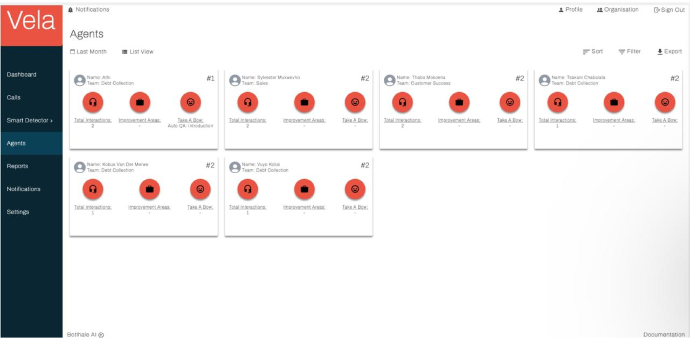

# Agents

The Agent screen functions offers you a view of your agents' performance. The information from this screen is available in both a list view, and a board view, illustrated in the images that follow. You can toggle between both views using the View icon in the top right of the screen.

Each entry within the agents screen includes: 
- Name: Unique identifier or display name of the agent.
- Team: Team to which the agent is assigned. 
- Calls/Interactions: Total number of calls handled by the agent within a designated timeframe. 
- Issues: Percentage of calls identified as containing customer concerns. 
- Strengths/Take a Bow: Top areas of agent strength, based on pre-defined metrics like resolution rate, customer satisfaction, and adherence to scripts. 
- Weaknesses/Improvement Areas: Areas identified for potential improvement, pinpointed through analysis of metrics like call handling time, missed customer cues, or script deviations. 
- Rank: Relative position within the team based on overall performance metrics. 
- Detailed View: Clicking on an agent's entry opens a dedicated page for granular analysis. This view will be discussed in the next subsection.

The Vela call screen facilitates efficient navigation and manipulation of your contact center data. 
Users can:

- Sort: Order entries by any table column, except the Detailed View column, for streamlined identification of specific agent performance metrics. 
- Filter: Apply targeted criteria based on various parameters enabling focused analysis on relevant interactions. 
- Export: Download the entire table as a CSV file for further analysis in external data visualisation or statistical software tools.

## Detailed Agent View 

The Vela detailed call screen provides an score card for individual agent metrics which users can download.

The following image shows the detailed agent card.

To access the detailed agent view while in List View: 
- Click on the View link in the Detailed View column which corresponds to the agent whose performance you'd like to view.

To access the detailed agent view while in Board View: Click on the View link in the Detailed View column which corresponds to the agent whose performance you'd like to view. 
- Click on the View link in the Detailed View column which corresponds to the agent whose performance you'd like to view.

## Contact us

:::info
We are here to help! Please [contact us](mailto:support@botlhale.ai) with any questions.
:::