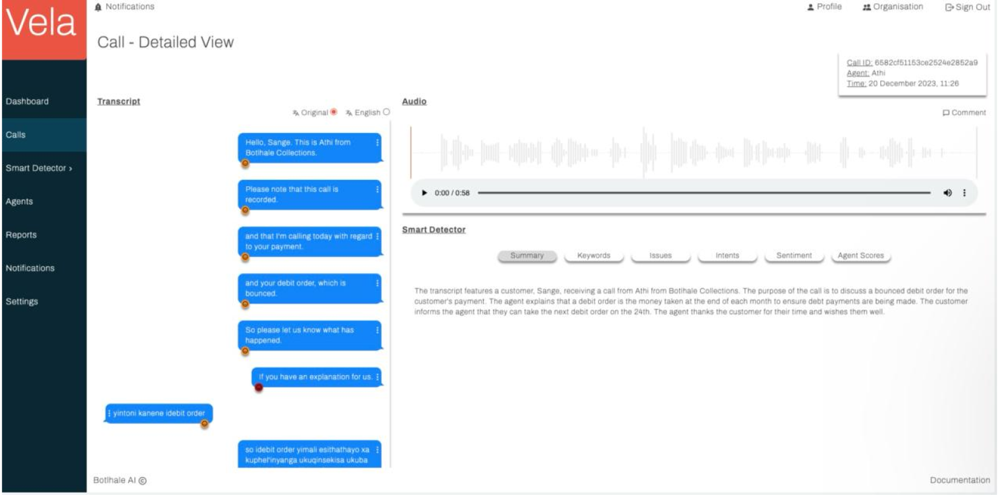

# Dashboard

The dashboard section of this documentation suite outlines processes related to navigating and customizing 
the Vela Dashboard for efficient exploration of call center analytics.

The Vela Dashboard serves as the primary interface for exploring the comprehensive analytics generated from your 
call centre data. It consolidates key performance indicators, emerging trends, and actionable insights into a  visually 
intuitive and customisable interface. This centralised hub empowers  diverse users, from contact centre managers 
monitoring overall performance to quality assurance analysts investigating specific interactions, to make data-driven 
decisions with swiftness and precision.

 The dashboard functionalities include: 

    • Comprehensive Overview: Aggregate metrics like silent time, sentiment and intent classification ,agent 
       performance, and call summarisation are readily available for at-aglance comprehension. 
  
    • Granular Exploration: Drill down into specific call segments using interactive charts and graphs, enabling 
      detailed analysis of customer sentiment, topic prevalence, and agent customer interactions. 

    • Customisation: Tailor the dashboard layout and data presentation to  align with you

The Vela Dashboard transforms raw call centre data into a compelling narrative,guiding you towards informed 
decision-making, operational optimisation, and  ultimately, superior customer experiences.

**Customise your dashboard**

Upon first log-in, your dashboard will appear blank. This is because you first need to customise
your dashboard to select the specific data points you would like a view of. Use the 
following steps to customise your dashboard. 

1. Ensure you are on the Dashboard screen of the Vela platform

2. Click the Customise Dashboard icon found on the top right corner or  the screen. A pop-up window appears, 
prompting you to select the datapoints you'd like displayed on your dashboard. 

3. Select the data points and their corresponding view. Note that data points may be specific to a view type.

4. Select the data points and their corresponding view. Note that data points may be specific to a view type

5. Click Save . Your dashboard is updated and displays your selected datapoints.

        a. Note that if your organisation has not uploaded any call data to the platform, your
        dashboard will display empty data
        cards. See the Data Upload section for more information on this.

6. Note that by default, the dashboard is:

        a. Not exportable.

        b. Set to an organisational view. For individual agent or team metrics, navigate to the
        Agent screen.

        c. Set to a week view. To switch to a month or day view, see the following three steps.
        To filter calls, click on the filter
        icon that corresponds to the data point you would like to
        customise.

7. To filter calls, click on the filter icon that corresponds to the data point you would like to customise. 7

8. A pop-up window appears, prompting you to select your desired view and timeframe

9. Select your desired view and timeframe, and click Save .
If you should, at any point, wish to change the datapoints you have a view of, perform steps
1-5 again.
