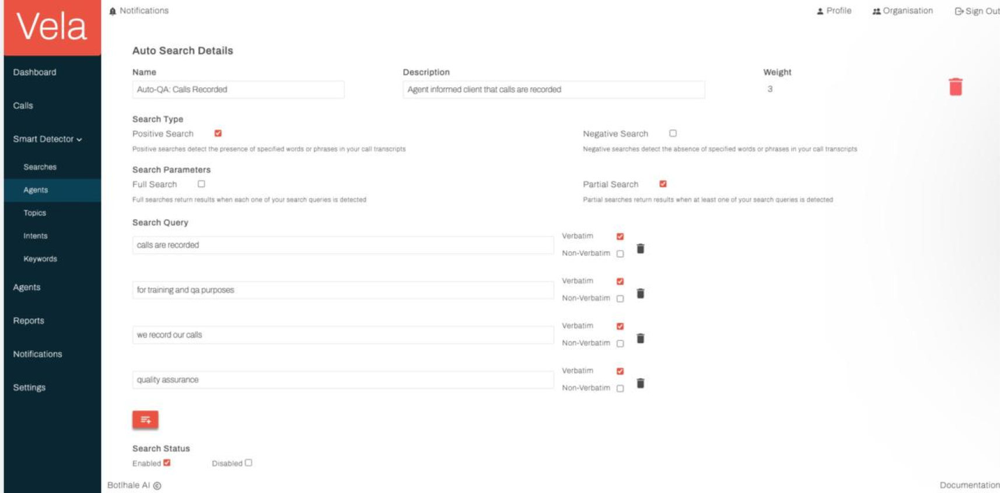
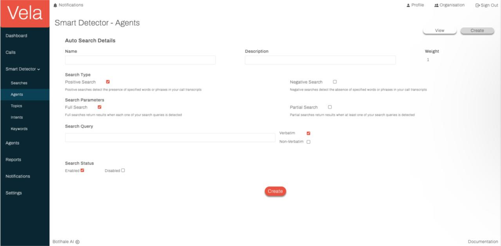
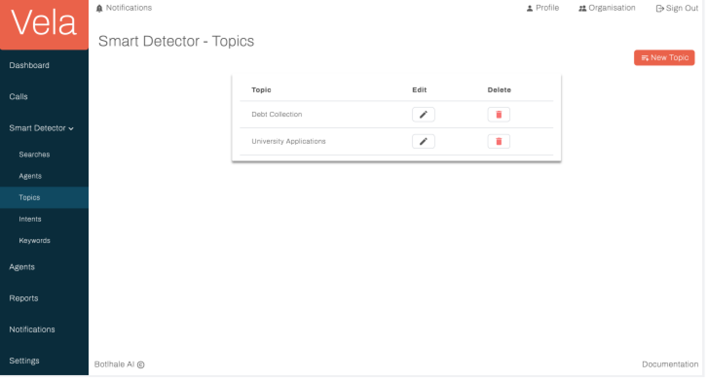

# Notifications & Settings

The Notifications Screen offers a centralised view of all platform alerts and updates, facilitating efficient monitoring 
and prompt action on critical issues, comments, and reports. On this screen, notifications are categorised into the
 following three dedicated tabs.

## Issues

This tab displays notifications related to potential problems picked up by the Smart Detector. See the Smart Detector 
section of this documentation for additional information.

Full details of the issue are not directly accessible from the notification card. Clicking the "View" icon on a specific issue notification card directs users to the corresponding detailed screen from which the issue stems. This allows for closer examination and contextual understanding of the issue.  It is important to note that closing or dismissing the issue notification card within the Notifications screen does not  mark the issue as resolved. To address the issue directly, users must navigate to the associated detailed screen and  utilise the designated resolution functions provided there.

## Comments

This tab presents notifications informing users about comments left by other team members on various elements, such as call transcripts.

Full details of the comment, including its complete text and context, are not directly accessible from the notification card. 
 
Clicking the **View** icon on a specific comment notification card directs users to the corresponding detailed screen (that is, the call transcript view) where the comment was originally left. 

This allows for closer examination and contextual understanding of the comment. It is important to note that closing or dismissing the comment notification card within the Notifications screen does not mark the comment as resolved. To address the comment directly, users must navigate to the associated detailed screen and utilise the designated resolution functions provided there.

## Reports

This tab provides notifications regarding newly generated reports becoming available.

Users can interact with report notifications through dedicated icons:

- View: Clicking the view icon opens the corresponding report in a new window, allowing users to access its full content. 
- Download: Clicking the download icon saves the report locally as a PDF for further analysis or sharing with external stakeholders. 
- Close: Clicking the close icon removes the notification card from the Reports tab, acknowledging the user's awareness of the report's availability.

It's important to note that closing a notification card does not automatically delete the report itself. Reports remain accessible through dedicated report management functionalities within the platform's Report screen

## Settings

The Settings Screen serves as a centralised hub for managing your account settings, preferences,
and organisational affiliations within the platform. It allows you to customise your user
experience, manage notifications, and access user administration functionalities (for users with
appropriate permissions).

Key Functionalities:

- Account: View and update your general profile information, including:
- Name
- Email address
- Organisation affiliation (primary and additional)
- Team assignment (if applicable)

## Organizations:

- View a list of organisations you belong to.
- Switch between your primary and secondary organisations using the dedicated icon.
- Create new organisations (admin privilege required).
- Edit existing organisation details (admin privilege required)

## Notifications:

- Set your preferred frequency for receiving notifications within the platform.
- Choose your desired notification delivery channels (platform, email, or both).

## Preferences:

- Customise your user interface display settings (e.g., theme, font size).
- Select your preferred language for platform interactions
- Set your default time zone for accurate data and time representations

## Security: 

- Update your account password for enhanced security.

## Users (Admin Privileges Required): 

- View a comprehensive list of users within your organisation(s). 
- Apply filters to refine the displayed user list based on specific criteria
- Add new users to your organisation(s). 
- Edit existing user information, including roles and permissions

## Contact us

:::info
We are here to help! Please [contact us](mailto:support@botlhale.ai) with any questions.
:::