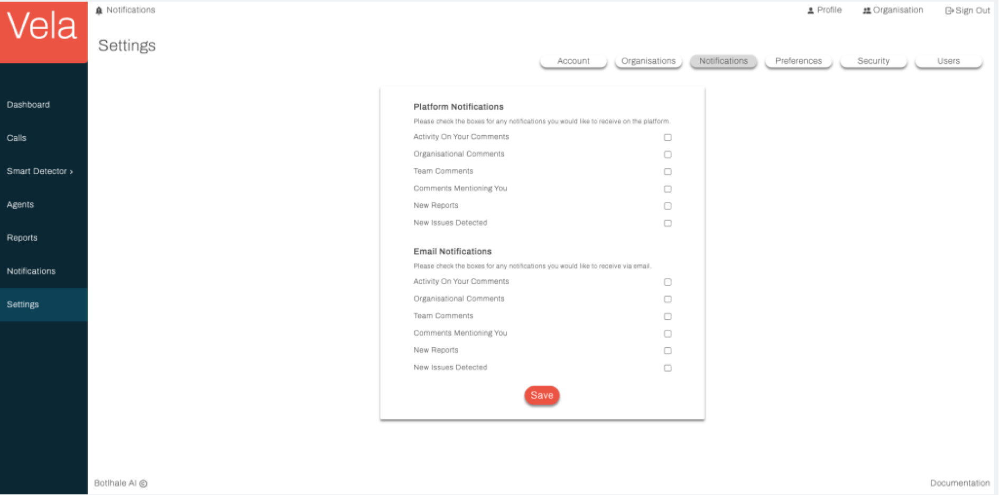
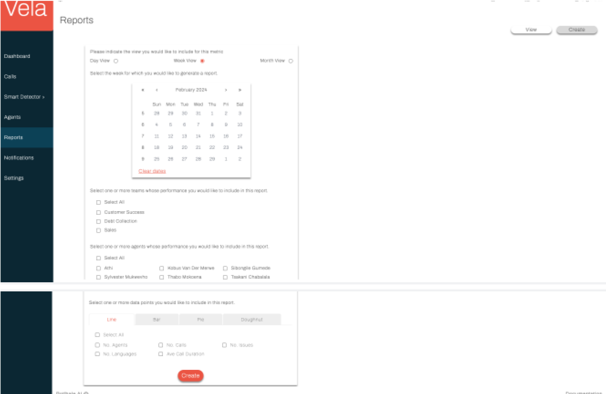

# Reports

The Vela Reports Screen serves as a central hub for generating and reviewing reports on your 
contact centre's performance.

View a Report

The View tab of this screen offers a view of all created reports alongside information relating to
when the reports were created and by whom. This tab also facilitates efficient navigation and
manipulation. Users can:

- **Sort:** Order entries by any table column, except the View and Download columns. 
- **Filter:** Apply targeted criteria based on various parameters like the date and creator. 
- View: View a specific report. 
- **Download:** Download a specific report as a pdf to their local machine

**Create a Report**

The Create tab of this screen allows you to create and generate a report by selecting the desired
metrics and parameters and clicking Create .

Once created, your report appears on the View tab of the page and is available to be viewed and downloaded by you and your team.

