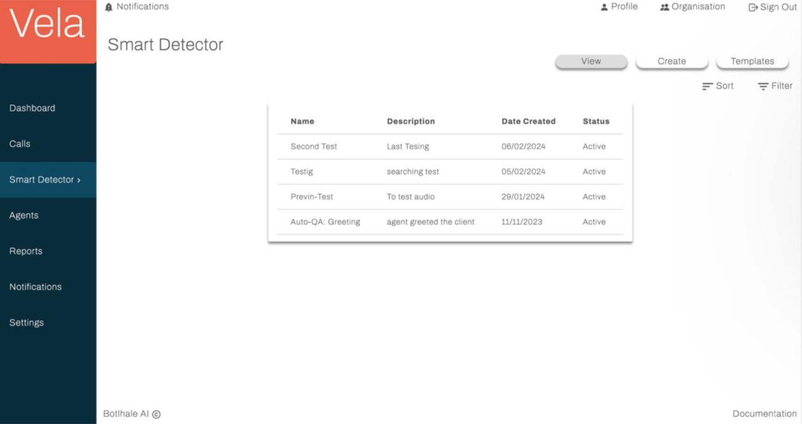

# Smart Detector

The Smart Detector section harnesses advanced natural language processing (NLP) and machine learning algorithms
to dissect individual calls.

The Smart Detector screen serves as the central hub for managing automated searches within your call transcript
data. It allows users to build complex search queries that identify the presence or absence of specific elements 
like words, phrases, or topics. Once activated, these pre-defined criteria continuously scan incoming transcripts,
automatically flagging matches as "issues" for further investigation and analysis. The Smart Detector page is 
organised into 4 tabs which allows the users to create and enable various search queries.

## General Search

This tab allows users to view and create general searches applicable to the entire corpus of call transcripts. It also
offers offers a library of pre-built search templates for common use cases.

**View**

The View tab of Vela's Smart Detector > General screen offers a tabular view of the auto search queries created 
within your organisation

The View tab facilitates efficient navigation of the created search queries. Users can:

- **Sort:** Order entries by any table column.
- **Filter:** Apply targeted criteria based on various parameters like the query's name, description, date, and status.

:::info
Clicking on a specific search query gives you a view of the specific details of a search as 
seen in the following image.
:::

**Create** 

The Create tab of this screen allows you to create new auto search queries within your organisation.

**To create a new auto search query:**

1. Ensure you are on the Create tab of the Smart Detector screen. 
2. Enter the requested information outlined and exemplified below. 
    - Name: Assign a unique name to your auto search query. 
    - Description: Provide a brief description of your auto search query. 
    - Search Type - Positive: Checking this box will enable the system to detect the presence of specified words or phrases in your call transcripts. 
    - Search Type - Negative: Selecting this option will configure the search to detect the absence of specified words or phrases in your call transcripts. 
    - Full Search: Enabling this ensures that results are returned only when each of your search queries is detected in the transcripts. 
    - Partial Search: When checked, this will return results when at least one of your search queries is detected.  
    - Search Query - Verbatim: Select this if you want the search to match the exact wording of your query. 
    - Search Query - Non-Verbatim: Choose this if the search can include transcripts that do not match the wording of your queries exactly. 
    - Search Status: Set the search status to 'Enabled' to activate the search query or 'Disabled' to deactivate it.
3. Once all information is entered, click on the CREATE button to establish the new auto search query.  
4. Your newly created auto search query appears on the View tab of the Smart Detector screen.

## Templates

The Templates tab of this screen allows you to review and enable predefined auto search queries within your organisation.

:::info
Insert image of template tab once templates have been created
:::

:::info
Clicking on the name of of a specific template brings you to a detailed view of the predefined 
auto search query and allows you to enable or disable the query.
:::

The Templates tab facilitates efficient navigation of the predefined search queries. Users can:

- **Sort:** Order entries by any table column. 
- **Filter:** Apply targeted criteria based on various parameters like the query's name, description, and status.

## Agent Search

This tab allows users to create and monitor searches specifically focused on individual agents' performance, identifying of trends and areas for improvement based on flagged issues. 

**View** 
Agent-specific searches are presented on the View tab in a tabular format.

The View tab facilitates efficient navigation of the created search queries. Users can:

- **Sort:** Order entries by any table column. 
- **Filter:** Apply targeted criteria based on various parameters like the query's name, description, date, and status.

:::info
Clicking on a specific agent search query gives you a view of the specific details of a search 
as seen in the following image.
:::

**Create**

The Create tab of this screen allows you to create new agent search queries within your organisation.

To create a new agent search query:

1. Ensure you are on the Create tab of the Smart Detector > Agents screen. 
2. Enter the requested information outlined and exemplified below. 
        - Name: Assign a unique name to your agent search query. 
        - Description: Provide a brief description of your agent search query. 
        - Search Type - Positive: Checking this box will enable the system to detect the presence of specified words or phrases in your call transcripts.  
        - Search Type - Negative: Selecting this option will configure the search to detect the absence of specified words or phrases in your call transcripts. 
        - Full Search: Enabling this ensures that results are returned only when each of your search queries is detected in the transcripts. 
        - Partial Search: When checked, this will return results when at least one of your search queries is detected. 
        - Search Query - Verbatim: Select this if you want the search to match the exact wording of your query. 
        - Search Query - Non-Verbatim: Choose this if the search can include transcripts that do not match the wording of your queries exactly. 
        - Search Status: Set the search status to 'Enabled' to activate the search query or 'Disabled' to deactivate it.
3. Once all information is entered, click on the CREATE button to establish the new agent search query. 
4. Your newly created agent search query appears on the View tab of the Smart Detector screen.

## Topic Search

This tab allows you to create and monitor user-defined topics for grouping calls based on specific themes or categories.

To create a new topic search: 

1. Click to the New Topic button.
2. In the pop-up window that appear, enter a unique name adequately representing the topic you wish to create. 
3. Click Create Topic. 
4. Your topic is created and displayed on the screen
5. You can edit or delete existing topic searches using the Edit or Delete icons

## Intent Search

This tab allows you to create and monitor searches which identify calls associated with particular intents within their dialogue flow.

To create a new intents search:

1. Click to the New Intent button. 
2. In the pop-up window that appears, enter a unique name adequately representing the intent you wish to create. 
3. Click Create Intent.
4. Your intent is created and displayed on the screen. 
5. You can edit or delete existing intent searches using the Edit or Delete icons

## Keyword Search

This tab allows you to create and monitor searches which track specific keywords or phrases across the call data. 

To create a new intents search

1. Click to the New Keyword button.  
2. In the pop-up window that appears, enter a keyword for the search you wish to create.
3. Click Create Keyword. 
4. Your keyword search is created and displayed on the screen.
5. You can edit or delete existing keyword searches using the Edit or Delete icons

## Contact us

:::info
We are here to help! Please [contact us](mailto:support@botlhale.ai) with any questions.
:::